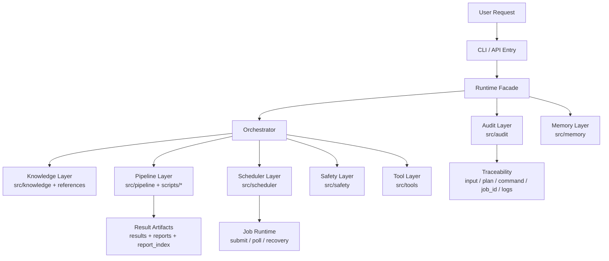
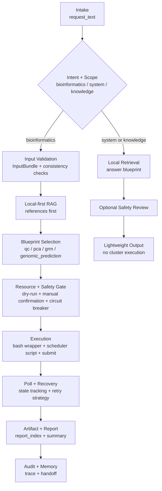

# GeneAgent

GeneAgent 是面向动物遗传育种与群体基因组分析场景的 Agent 工程项目。当前文档以 **V1.5 行为真相源** 为准。

系统框架总览（单页真相源）：
- `docs/v1_5_system_map.md`

## Mandatory HANDOFF Protocol
- Always update `docs/HANDOFF.md` at three checkpoints: after each stage task is completed, before context compression, and before opening a new window.
- Always start a resumed/new-window session by reading `docs/HANDOFF.md` first, then verifying `git status --short` and key files before changing code.
- Treat HANDOFF as continuity support, not truth by itself; if conflict exists, trust `AGENTS.md` and real code/command output, then repair HANDOFF immediately.
- Use the `HANDOFF v2` schema in `docs/HANDOFF.md` (stage mapping, cluster policy, gate evidence, next executable action).
- Do not declare a stage task completed unless HANDOFF has been updated in the same session.

## Windows PowerShell 标准启动命令
在 `D:\geneagent` 打开 PowerShell 后，按顺序执行：

```powershell
cd D:\geneagent
Set-ExecutionPolicy -Scope Process Bypass
.\.venv\Scripts\Activate.ps1
python -m pip install --upgrade pip setuptools wheel
python -m pip install -e ".[dev]"
python -m compileall src tests
python -m pytest -q
```

常用开发命令：

```powershell
python -m cli.app doctor
python -m cli.app plan "Run PCA population structure analysis for this sheep cohort and generate a report" --working-directory D:\geneagent --input-entry "vcf=D:\data\sheep\cohort_01\sheep_cohort.vcf.gz" --input-species sheep
python -m cli.app dry-run --working-directory D:\geneagent --request-text "Prepare a dry-run for PCA on this sheep cohort" --input-entry "vcf=D:\data\sheep\cohort_01\sheep_cohort.vcf.gz"
python -m cli.app submit-preview --working-directory D:\geneagent --request-text "Submit preview for genomic prediction on this sheep cohort" --input-entry "vcf=D:\data\sheep\cohort_01\sheep_cohort.vcf.gz" --input-entry "phenotype_table=D:\data\sheep\cohort_01\phenotype.tsv" --dry-run-completed
python -m cli.app submit --working-directory D:\geneagent --request-text "Submit genomic prediction on this sheep cohort" --input-entry "vcf=D:\data\sheep\cohort_01\sheep_cohort.vcf.gz" --input-entry "phenotype_table=D:\data\sheep\cohort_01\phenotype.tsv" --dry-run-completed
python -m cli.app poll-explain SLURM-12345
python -m cli.app report --working-directory D:\geneagent --request-text "Generate report index for latest run"
python -m cli.app diagnostic --working-directory D:\geneagent --request-text "Diagnose scheduler/tool failures"
python -m api.app
```

## V1.5 当前定位
- 顶层分流：`bioinformatics / system / knowledge`
- 生信主链蓝图：`qc / pca / grm / genomic_prediction`
- 主链一级输入：`request_text + working_directory + InputBundle`
- 主链能力：`plan -> dry-run -> submit -> poll -> artifact/report -> audit/memory`
- 非生信支路：`intake -> local retrieval -> answer blueprint`（不进集群）

## GeneAgent 框架图


## GeneAgent 工作流程图


## 防偏离开发流程（每次开发必走）
1. 先判定请求类型：`bioinformatics / system / knowledge`，并写明是否允许进入集群执行。
2. 绑定阶段与归属：至少标注本次变更对应的 `stage_id`（如 `stage_05_blueprint_selection`）和目录归属（如 `src/pipeline/`）。
3. 固化输入输出契约：明确本次改动影响的契约对象与字段，不允许“只改行为不改契约说明”。
4. 同步测试映射：新增或修改行为必须映射到 `unit/integration/e2e` 中至少一层测试。
5. 跑门禁：`python -m compileall src tests` + `python -m pytest -q`。
6. 更新文档真相源：行为变化必须同步更新 `README.md`、`AGENTS.md` 和 `docs/v1_5_system_map.md` 中至少一处对应描述。

## V1.5 请求分流判定表
| 请求类型 | 典型目标 | 是否进集群 | 关键产物 |
|---|---|---|---|
| `bioinformatics` | `qc/pca/grm/genomic_prediction` | 是 | `scheduler script`、`job_id`、`artifact/report_index`、`audit/memory` |
| `system` | 调度/环境/错误诊断 | 否（默认） | `diagnostic preview`、修复建议、审计记录 |
| `knowledge` | 方法咨询/方案解释 | 否 | `answer blueprint`、引用依据、审计记录 |

## V1.5 关键契约速查
1. `RunContext`：必须可追溯到 `task_id / run_id / session_id / working_directory`。
2. `PipelineSpec`：必须体现 `name / blueprint_key / analysis_targets / stage_contract / artifact_contract`。
3. `SubmissionPreview`：必须体现 `mode / cluster_execution_enabled / command / scheduler_script_path / gate_decision / artifacts`。
4. `DiagnosticPreview`：必须体现 `retrieval_mode / coverage / fallback_gate_decision / diagnostic_suggestions / non_bio_cluster_policy`。
5. `report_index.v2`：必须至少包含 `schema_version / run_context / collections / blueprint_summary / diagnostics / traceability / summary`。

## 变更提交说明模板（建议直接复用）
```text
变更目标:
- 本次要解决的业务问题和边界

阶段映射:
- stage_id:
- intent_domain:
- 是否进入集群:

目录归属:
- 变更文件:

契约影响:
- 新增/变更字段:
- 兼容性说明:

测试与门禁:
- compileall:
- pytest:
- 新增/更新测试:

风险与回滚:
- 已知风险:
- 回滚方式:
```

## V1.5 标准执行链（生信主链）
1. `Intake`：自然语言请求标准化，产出 `task_id / run_id / session_id`
2. `Intent + Scope`：识别 `bioinformatics / system / knowledge`
3. `Input Validation`：原始路径归一化为 `InputBundle`，校验 VCF/PLINK/BAM/表型/协变量/谱系一致性
4. `Local-first RAG`：优先检索 `references/*`、本地 SOP、模板和历史规范
5. `Blueprint Selection`：严格绑定 `qc / pca / grm / genomic_prediction`，输出阶段清单与产物契约
6. `Resource + Safety Gate`：资源估算、dry-run 预览、人工确认项、熔断条件
7. `Execution`：生成 Bash wrapper + scheduler script，执行提交、轮询与失败恢复
8. `Artifact + Report`：收集结果/图表/日志，生成报告索引与解释摘要
9. `Audit + Memory`：落盘输入摘要、规划摘要、提交命令、job id、日志路径、人工确认记录

## 非生信轻量支路（硬约束）
流程：
`intake -> local retrieval -> answer blueprint -> safety review if needed`

约束：
- 不进入集群执行
- 不生成调度脚本
- 不触发 `submit/poll`
- 不分配集群 job id

## 调度与执行语义
- `SLURM` 为主线，`PBS` 为兼容适配
- 语义对齐：`submit / poll / recovery`
- 命令族示例：
  - SLURM：`sbatch / squeue / sacct`
  - PBS：`qsub / qstat`

## Local-first Knowledge 策略
- 本地优先检索，仅在本地命中覆盖不足且通过安全门禁时才允许外部回退
- 外部回退为显式分支，不覆盖本地基准知识，只作为补充证据
- 错误诊断优先使用 `references/*` 与本地知识条目，输出可执行修复建议

## CLI / API 覆盖面（V1.5）
CLI 重点命令：
- `plan`
- `dry-run`
- `submit-preview`
- `submit`
- `poll-explain`
- `report`
- `diagnostic`

API 重点路由：
- `POST /tasks/draft-plan`
- `POST /tasks/dry-run`
- `POST /tasks/submit-preview`
- `POST /tasks/submit`
- `POST /tasks/poll-explain`
- `POST /tasks/report`
- `POST /tasks/diagnostic`

## V1.5 验收标准
- `python -m pytest -q` 全绿
- `python -m compileall src tests` 通过
- 生信请求可走 `dry-run/submit/poll` 闭环
- `qc / pca / grm / genomic_prediction` 均产出结构化计划、脚本与产物索引（含 `report_index`）
- non-bio 请求明确“不进集群”

## 目录与架构
目录宪章、模块边界、角色路由以 `AGENTS.md` 为单一真相源。  
禁止通过平行源码目录进行版本分叉（如 `src_v2/`、`new_src/` 等）。

## 运行环境边界
- 默认开发环境：Windows 10/11 + PowerShell + WSL2（混合模式）
- 生产执行边界：Linux/HPC 调度节点
- WSL2：推荐混合开发路径（用于 bash 与类 Linux 工具链）；macOS：兼容开发路径

## 安全边界
- 原始实体数据（VCF/BAM/FASTQ/FASTA）不得离开本地计算环境
- 允许上云信息仅限：Prompt、脱敏错误摘要、工具输出摘要、软件版本、参数结构
- 高风险动作必须人工确认：覆盖结果、删除文件、跨目录写入、异常资源申请、失败任务重投

## 路线图
- `V1`：已完成基线闭环（分流、四蓝图、主链调度、审计与记忆回写）
- `V1.5`：当前行为真相源（PBS 兼容、report/diagnostic、manifest 体系化、知识检索补强）
- `V2`：后续扩展（插件化工具生态、增强记忆系统、更广泛多组学模板）

## 声明
GeneAgent 是流程编排与研究辅助系统，不替代研究者做最终生物学解释与育种决策。
