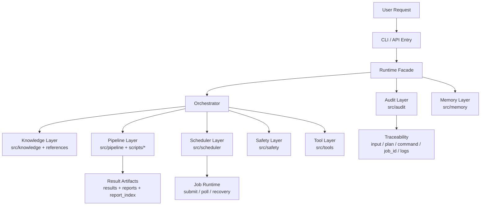
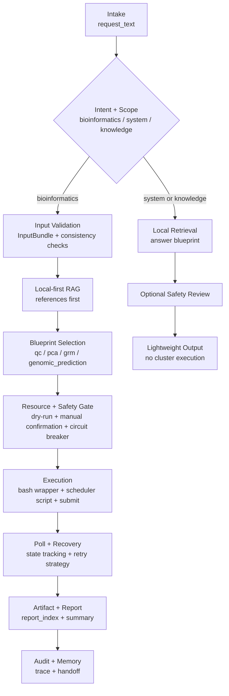

# GeneAgent

GeneAgent 是面向动物遗传育种与群体基因组分析场景的 Agent 工程项目。当前文档以 **V2 阶段** 为准；V1/V1.5 作为历史基线与继承来的核心执行闭环说明。

系统框架总览（单页真相源）：
- `docs/v2_system_map.md`

## V2 Operational Guides
- `docs/knowledge_update_workflow.md`: knowledge asset ingest/update workflow and evidence-chain regression checks.
- `docs/pipeline_pack_integration_guide.md`: blueprint pack contract and integration checklist.
- `docs/tool_manifest_authoring_spec.md`: tool manifest schema/rules and validation checklist.

## M3 Safety Controls
- Manual approval flow for high-risk actions now supports approver/reason/timestamp evidence and audit persistence.
- Scheduler budget/quota gate now checks CPU-hours, memory, and concurrent job limits before submit readiness.
- Outbound payload policy now enforces allow-listed cloud fields, sanitizes path-like content, and trips breaker on violations.

## Mandatory HANDOFF Protocol
- Always update `docs/HANDOFF.md` at three checkpoints: after each stage task is completed, before context compression, and before opening a new window.
- Always start a resumed/new-window session by reading `docs/HANDOFF.md` and `AGENTS.md` first, then verifying `git status --short` and key files before changing code.
- Treat HANDOFF as continuity support, not truth by itself; if conflict exists, trust `AGENTS.md` and real code/command output, then repair HANDOFF immediately.
- Use the `HANDOFF v2` schema in `docs/HANDOFF.md` (stage mapping, cluster policy, gate evidence, next executable action).
- Do not declare a stage task completed unless HANDOFF has been updated in the same session.

## Windows PowerShell 标准启动命令
在 `D:\geneagent` 打开 PowerShell 后，按顺序执行：

```powershell
# 如果 PowerShell profile 被执行策略拦截，可先用无 profile shell：
powershell.exe -NoProfile -ExecutionPolicy Bypass
cd D:\geneagent
Set-ExecutionPolicy -Scope Process Bypass
$env:PYTHONUTF8 = "1"
$env:PYTHONIOENCODING = "utf-8"
$env:PYTHONPYCACHEPREFIX = "D:\geneagent\pycache_temp"
.\.venv\Scripts\Activate.ps1
python -m pip install --upgrade pip setuptools wheel
python -m pip install -e ".[dev]"
python -m compileall src tests
python -m pytest -q
```

常用开发命令：

```powershell
python -m cli.app doctor
python -m cli.app plan "Run PCA population structure analysis for this sheep cohort and generate a report" --working-directory D:\geneagent --input-entry "vcf=D:\data\sheep\cohort_01\sheep_cohort.vcf.gz" --input-species sheep
python -m cli.app dry-run --working-directory D:\geneagent --request-text "Prepare a dry-run for PCA on this sheep cohort" --input-entry "vcf=D:\data\sheep\cohort_01\sheep_cohort.vcf.gz"
python -m cli.app submit-preview --working-directory D:\geneagent --request-text "Submit preview for genomic prediction on this sheep cohort" --input-entry "vcf=D:\data\sheep\cohort_01\sheep_cohort.vcf.gz" --input-entry "phenotype_table=D:\data\sheep\cohort_01\phenotype.tsv" --dry-run-completed
python -m cli.app submit --working-directory D:\geneagent --request-text "Submit genomic prediction on this sheep cohort" --input-entry "vcf=D:\data\sheep\cohort_01\sheep_cohort.vcf.gz" --input-entry "phenotype_table=D:\data\sheep\cohort_01\phenotype.tsv" --dry-run-completed
python -m cli.app poll-explain SLURM-12345
python -m cli.app report --working-directory D:\geneagent --request-text "Generate report index for latest run"
python -m cli.app diagnostic --working-directory D:\geneagent --request-text "Diagnose scheduler/tool failures"
python -m api.app
```

## V2 当前定位
- V2 是当前完成阶段，继承 V1.5 核心执行闭环，并补齐稳定 API、console、observability、audit export、production/release governance。
- V1.5 是过渡增强基线，用于描述四条生信主链、调度、报告、审计、知识检索等执行内核。
- 顶层分流：`bioinformatics / system / knowledge`
- 生信主链蓝图：`qc / pca / grm / genomic_prediction`
- 主链一级输入：`request_text + working_directory + InputBundle`
- 主链能力：`plan -> dry-run -> submit -> poll -> artifact/report -> audit/memory`
- 非生信支路：`intake -> local retrieval -> answer blueprint`（不进集群）

## GeneAgent 框架图

```mermaid
flowchart TD
    U["User Request"] --> E["CLI / API Entry"]
    E --> F["Runtime Facade"]
    F --> O["Orchestrator"]

    O --> K["Knowledge Layer\nsrc/knowledge + references"]
    O --> P["Pipeline Layer\nsrc/pipeline + scripts/*"]
    O --> S["Scheduler Layer\nsrc/scheduler"]
    O --> G["Safety Layer\nsrc/safety"]
    O --> T["Tool Layer\nsrc/tools"]

    F --> A["Audit Layer\nsrc/audit"]
    F --> M["Memory Layer\nsrc/memory"]

    P --> R["Result Artifacts\nresults + reports + report_index"]
    S --> J["Job Runtime\nsubmit / poll / recovery"]
    A --> TR["Traceability\ninput / plan / command / job_id / logs"]
```

## GeneAgent 工作流程图

```mermaid
flowchart TD
    I["Intake\nrequest_text"] --> D{"Intent + Scope\nbioinformatics / system / knowledge"}

    D -->|bioinformatics| B1["Input Validation\nInputBundle + consistency checks"]
    B1 --> B2["Local-first RAG\nreferences first"]
    B2 --> B3["Blueprint Selection\nqc / pca / grm / genomic_prediction"]
    B3 --> B4["Resource + Safety Gate\ndry-run + manual confirmation + circuit breaker"]
    B4 --> B5["Execution\nbash wrapper + scheduler script + submit"]
    B5 --> B6["Poll + Recovery\nstate tracking + retry strategy"]
    B6 --> B7["Artifact + Report\nreport_index + summary"]
    B7 --> B8["Audit + Memory\ntrace + handoff"]

    D -->|system or knowledge| N1["Local Retrieval\nanswer blueprint"]
    N1 --> N2["Optional Safety Review"]
    N2 --> N3["Lightweight Output\nno cluster execution"]
```

## 防偏离开发流程（每次开发必走）
1. 先判定请求类型：`bioinformatics / system / knowledge`，并写明是否允许进入集群执行。
2. 绑定阶段与归属：至少标注本次变更对应的 `stage_id`（如 `stage_05_blueprint_selection`）和目录归属（如 `src/pipeline/`）。
3. 固化输入输出契约：明确本次改动影响的契约对象与字段，不允许“只改行为不改契约说明”。
4. 同步测试映射：新增或修改行为必须映射到 `unit/integration/e2e` 中至少一层测试。
5. 跑门禁：`python -m compileall src tests` + `python -m pytest -q`。
6. 更新文档真相源：行为变化必须同步更新 `README.md`、`AGENTS.md` 和 `docs/v2_system_map.md` 中至少一处对应描述。

## V2 请求分流判定表（继承 V1.5 基线）
| 请求类型 | 典型目标 | 是否进集群 | 关键产物 |
|---|---|---|---|
| `bioinformatics` | `qc/pca/grm/genomic_prediction` | 是 | `scheduler script`、`job_id`、`artifact/report_index`、`audit/memory` |
| `system` | 调度/环境/错误诊断 | 否（默认） | `diagnostic preview`、修复建议、审计记录 |
| `knowledge` | 方法咨询/方案解释 | 否 | `answer blueprint`、引用依据、审计记录 |

## V2 关键契约速查（继承 V1.5 基线）
1. `RunContext`：必须可追溯到 `task_id / run_id / session_id / working_directory`。
2. `PipelineSpec`：必须体现 `name / blueprint_key / analysis_targets / stage_contract / artifact_contract`。
3. `SubmissionPreview`：必须体现 `mode / cluster_execution_enabled / command / scheduler_script_path / gate_decision / artifacts`。
4. `DiagnosticPreview`：必须体现 `retrieval_mode / coverage / fallback_gate_decision / diagnostic_suggestions / non_bio_cluster_policy`。
5. `report_index.v2`：必须至少包含 `schema_version / run_context / collections / blueprint_summary / diagnostics / traceability / summary`。

## 变更提交说明模板（建议直接复用）
```text
变更目标:
- 本次要解决的业务问题和边界

阶段映射:
- stage_id:
- intent_domain:
- 是否进入集群:

目录归属:
- 变更文件:

契约影响:
- 新增/变更字段:
- 兼容性说明:

测试与门禁:
- compileall:
- pytest:
- 新增/更新测试:

风险与回滚:
- 已知风险:
- 回滚方式:
```

## V2 标准执行链（继承 V1.5 生信主链）
1. `Intake`：自然语言请求标准化，产出 `task_id / run_id / session_id`
2. `Intent + Scope`：识别 `bioinformatics / system / knowledge`
3. `Input Validation`：原始路径归一化为 `InputBundle`，校验 VCF/PLINK/BAM/表型/协变量/谱系一致性
4. `Local-first RAG`：优先检索 `references/*`、本地 SOP、模板和历史规范
5. `Blueprint Selection`：严格绑定 `qc / pca / grm / genomic_prediction`，输出阶段清单与产物契约
6. `Resource + Safety Gate`：资源估算、dry-run 预览、人工确认项、熔断条件
7. `Execution`：生成 Bash wrapper + scheduler script，执行提交、轮询与失败恢复
8. `Artifact + Report`：收集结果/图表/日志，生成报告索引与解释摘要
9. `Audit + Memory`：落盘输入摘要、规划摘要、提交命令、job id、日志路径、人工确认记录
10. `V2 Control Plane`：通过 `/v2/*` API、console、observability、audit export、production gate、release plan、final review 提供稳定治理与运维入口

## 非生信轻量支路（硬约束）
流程：
`intake -> local retrieval -> answer blueprint -> safety review if needed`

约束：
- 不进入集群执行
- 不生成调度脚本
- 不触发 `submit/poll`
- 不分配集群 job id

## 调度与执行语义
- `SLURM` 为主线，`PBS` 为兼容适配
- 语义对齐：`submit / poll / recovery`
- 命令族示例：
  - SLURM：`sbatch / squeue / sacct`
  - PBS：`qsub / qstat`

## Local-first Knowledge 策略
- 本地优先检索，仅在本地命中覆盖不足且通过安全门禁时才允许外部回退
- 外部回退为显式分支，不覆盖本地基准知识，只作为补充证据
- 错误诊断优先使用 `references/*` 与本地知识条目，输出可执行修复建议

## 知识库分层总结表
| 层级 | 路径 | 内容 | 版本控制 | 用途 |
|---|---|---|---|---|
| **Git版本化知识资产** | `references/*` | 文献卡片、SOP、参数手册、失败案例 | ✅ Git跟踪 | 团队协作、可审查、可复现 |
| **本地运行知识库** | `.geneagent/knowledge/*` | 原始PDF、GROBID解析、切块、索引 | ❌ 本地生成 | 检索、摄取、私有缓存 |
| **知识元信息** | `references/ontology/` | `knowledge_item.v2` schema、术语表 | ✅ Git跟踪 | 元数据规范、可追溯性 |

关键原则：
- 版权受限 -> 本地库
- 可共享摘要 -> Git版本化
- 检索索引 -> 本地构建，不提交

## CLI / API 覆盖面（V2）
CLI 重点命令：
- `plan`
- `dry-run`
- `submit-preview`
- `submit`
- `poll-explain`
- `report`
- `diagnostic`
- `audit-export`
- `observability`
- `production-gate`
- `release-plan`
- `final-review`

API 重点路由（V1 兼容）：
- `POST /tasks/draft-plan`
- `POST /tasks/dry-run`
- `POST /tasks/submit-preview`
- `POST /tasks/submit`
- `POST /tasks/poll-explain`
- `POST /tasks/report`
- `POST /tasks/diagnostic`
- `POST /tasks/audit-export`

API 重点路由（V2 稳定）：
- `POST /v2/tasks/draft-plan`
- `POST /v2/tasks/dry-run`
- `POST /v2/tasks/submit-preview`
- `POST /v2/tasks/submit`
- `POST /v2/tasks/poll-explain`
- `POST /v2/tasks/report`
- `POST /v2/tasks/diagnostic`
- `POST /v2/tasks/audit-export`

API 控制平面（V2）：
- `GET /v2/version-policy`
- `GET /v2/console`
- `GET /v2/console/board`
- `GET /v2/console/runs/{run_id}`
- `GET /v2/observability/metrics`
- `GET /v2/observability/dashboard`
- `POST /v2/release/production-gate`
- `POST /v2/release/plan`
- `GET /v2/release/final-review`

## V2 验收标准（继承 V1.5 核心闭环）
- `python -m pytest -q` 全绿
- `python -m compileall src tests` 通过
- 生信请求可走 `dry-run/submit/poll` 闭环
- `qc / pca / grm / genomic_prediction` 均产出结构化计划、脚本与产物索引（含 `report_index`）
- non-bio 请求明确“不进集群”

## 目录与架构
目录宪章、模块边界、角色路由以 `AGENTS.md` 为单一真相源。  
禁止通过平行源码目录进行版本分叉（如 `src_v2/`、`new_src/` 等）。

## 运行环境边界
- 主要部署平台：Linux HPC 集群（登录节点 + 计算节点）
- 队列系统：`SLURM / PBS / SGE`
- 文件系统：POSIX 兼容（支持大文件与高并发 I/O）
- 网络访问：内网环境，数据不出集群
- 环境一致性：路径统一使用 `/`，脚本 shebang 使用 `#!/usr/bin/env bash`，编码统一 UTF-8，换行统一 LF
- Windows 开发注意事项（如必须使用）：
  - 必须通过 WSL2 执行所有生信工具调用和调度脚本
  - Git 建议配置：`git config --global core.autocrlf input`
  - 测试必须在 WSL2 环境验证，不能仅在 PowerShell 验证

## 安全边界
- 原始实体数据（VCF/BAM/FASTQ/FASTA）不得离开本地计算环境
- 允许上云信息仅限：Prompt、脱敏错误摘要、工具输出摘要、软件版本、参数结构
- 高风险动作必须人工确认：覆盖结果、删除文件、跨目录写入、异常资源申请、失败任务重投

## V2 已完成功能（M3）
- V2 稳定任务路由已落地：`/v2/tasks/*`，并保留 `/tasks/*` 兼容窗口。
- 版本治理已落地：`/v2/version-policy` 提供兼容窗口与弃用策略信息。
- 审计导出已落地：API `POST /tasks/audit-export`、`POST /v2/tasks/audit-export`，CLI `audit-export`。
- 最小 Web Console 已落地：`/v2/console`、`/v2/console/board`、`/v2/console/runs/{run_id}`，支持状态/报告/诊断联动。
- 可观测性已落地：`/v2/observability/metrics`、`/v2/observability/dashboard`，CLI `observability`。
- 发布治理已落地：`/v2/release/production-gate`、`/v2/release/plan`、`/v2/release/final-review`，CLI `production-gate` / `release-plan` / `final-review`。
- 配套文档已落地：`docs/release_process_v2.md`、`docs/v2_0_final_acceptance_review.md`。

## 路线图
- `V1`：早期基础闭环（分流、四蓝图、主链调度、审计与记忆回写）
- `V1.5`：通向 V2 的过渡增强基线（PBS 兼容、report/diagnostic、manifest 体系化、知识检索补强）
- `V2`：当前完成阶段，包含 V1.5 核心闭环 + versioning/console/observability/audit export/release governance
- `V2 hardening / V2.x expansion`：后续聚焦插件化工具生态、增强记忆系统、更广泛多组学模板、生产级权限与签名边界

## 声明
GeneAgent 是流程编排与研究辅助系统，不替代研究者做最终生物学解释与育种决策。
